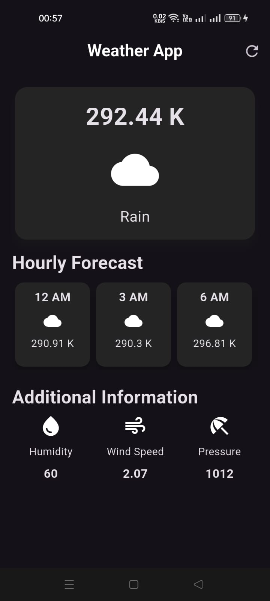
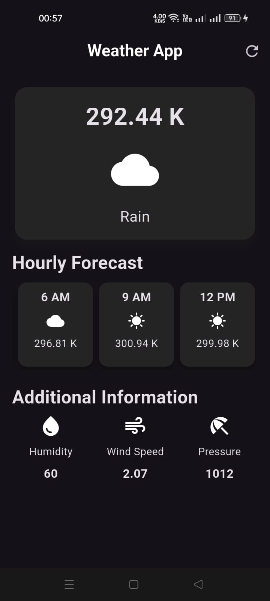

# 🌤️ Flutter Weather App

A beautiful and functional weather forecasting app built with Flutter. This app fetches real-time weather data using the OpenWeather API and provides current weather conditions, hourly forecasts, and additional weather information in a sleek UI.

## 📸 Screenshots

### HomeScreen Forecast



### Hourly Forecast




## 🚀 Features

- 🌍 **Real-Time Weather Updates**: Get the latest weather data for any city.
- ⏳ **Hourly Forecast**: View upcoming temperature changes with weather icons.
- 📊 **Additional Weather Info**: Check humidity, wind speed, and atmospheric pressure.
- 🎨 **Beautiful UI**: Dark-themed, card-based layout with material design.
- 🔄 **Refresh Button**: Instantly update the weather data.

## 🛠️ Tech Stack

- **Flutter**: For cross-platform development.
- **Dart**: Programming language.
- **OpenWeather API**: Fetches live weather data.
- **Intl Package**: Handles date formatting.
- **HTTP Package**: Manages API calls.

## 📂 Project Structure

📂 lib
 ┣ 📜 main.dart                # Entry point of the app
 ┣ 📜 weather_screen.dart       # Main weather UI
 ┣ 📜 additional_info_item.dart # Widget for extra weather details
 ┣ 📜 hourly_forecast_item.dart # Widget for hourly forecast

## 📦 Setup & Installation

1. **Clone the Repository**

   ```sh
   git clone https://github.com/yourusername/weather-app.git
   cd weather-app
   ```

2. **Get Dependencies**

   ```sh
   flutter pub get
   ```

3. **Run the App**

   ```sh
   flutter run
   ```

## 🔧 Customization

- Change the default city in `weather_screen.dart`:

  ```dart
  String cityname = "YourCity";
  ```

- Modify UI styles in `hourly_forecast_item.dart` and `additional_info_item.dart`.
